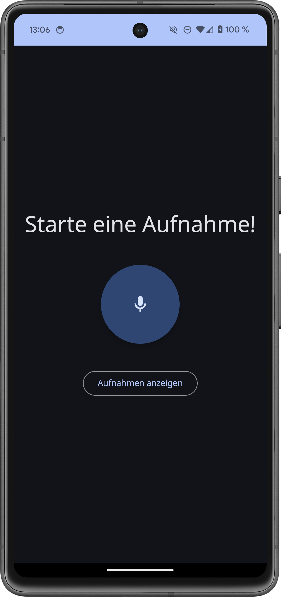
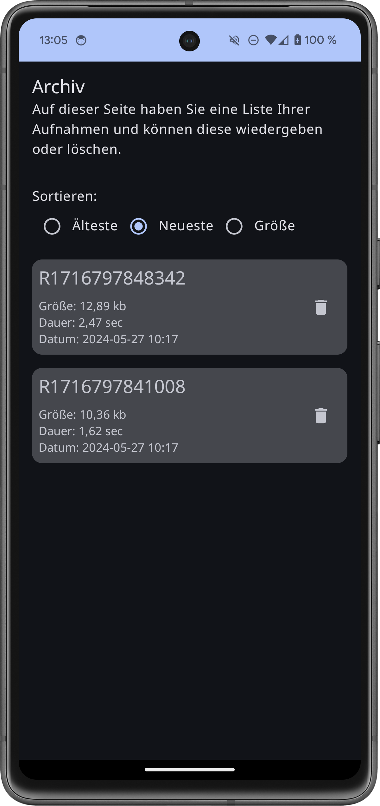

# Documentation Audio Recorder

  

## Package: `at.winter.audioRecorder`

### Class: `MainActivity`

### Description:

The main activity of the app, managing UI setup and lifecycle.

### Fields:

- `db`: `RecordingDatabase` instance for Room database management.
- `viewModel`: `RecordingViewModel` instance for UI state management.

### Functions:

- `onCreate(savedInstanceState: Bundle?)`: Initializes the activity and sets up UI using Jetpack Compose. Observes `RecordingViewModel` state and renders the navigation flow.

### Composable Function:

- `Navigation(state: RecordingState, onEvent: (RecordingEvent) -> Unit, activity: Activity)`: Renders navigation flow with Jetpack Compose.

## Package: `at.winter.audioRecorder.data`

### `Recording` Data Class

- **Description**: Represents a recording entity with details like name, size, file data, duration, timestamp, and unique identifier.
- **Fields**: `name`, `size`, `file`, `duration`, `unixTimestamp`, `id`

### `RecordingDao` Interface

- **Description**: Data Access Object (DAO) for CRUD operations on `Recording` entity.
- **Functions**: `insertRecording`, `deleteRecord`, `getRecordsOrderedByTimeStampAsc`, `getRecordsOrderedByTimeStampDesc`, `getRecordsOrderedBySize`

### `RecordingDatabase` Abstract Class

- **Description**: Manages instances of the Room database.
- **Entities**: `Recording`
- **Version**: 1

## Package: `at.winter.audioRecorder.navigation`

### `Navigation` Composable Function

- **Description**: Manages app navigation using Jetpack Compose and the `NavHost`.
- **Parameters**: `state`, `activity`, `onEvent`.
- **Usage**: Sets up navigation between `MainScreen` and `RecordingsScreen`.

### `Screen` Sealed Class

- **Description**: Defines available screens in the app.
- **Subclasses**: `MainScreen`, `RecordingsScreen`.

### `MainScreen`

- **Route**: "main_screen"
- **Description**: Main app screen with recording functionalities.

### `RecordingsScreen`

- **Route**: "recordings_screen"
- **Description**: Displays recorded audio files for replay and deletion.

## Package: `at.winter.audioRecorder.screens`

### `MainScreen` Composable Function

- **Description**: Displays the main screen of the app with options to start/stop recording and navigate to recordings screen.
- **Parameters**: `onOpenRecordings`, `state`, `activity`, `onEvent`.

### `RecordElement` Composable Function

- **Description**: Represents the recording element, including the record button and timer.
- **Parameters**: `recordingStarted`, `onPermissionDenied`, `onClick`, `modifier`.
- **Usage**: Provides functionality for starting/stopping recording and displays the recording timer.

### `RecordingsScreen` Composable Function

- **Description**: Displays the screen for managing recorded audio files.
- **Parameters**: `state`, `onEvent`.
- **Usage**: Lists recorded audio files with options to replay and delete.

### `RecordingItem` Composable Function

- **Description**: Represents a single recorded audio item in the recordings list.
- **Parameters**: `recording`, `onStartReplay`, `onDeleteRecording`.
- **Usage**: Displays details of a recorded audio file and provides options to replay or delete it.

## Package: `at.winter.audioRecorder.utils.AudioPlayer`

### `AndroidAudioPlayer` Class

- **Description**: Implements the `AudioPlayer` interface for playing audio files using Android's `MediaPlayer`.
- **Fields**: `context`, `player`.
- **Functions**:
    - `playMedia(file: File)`: Starts playing the specified audio file.
    - `stop()`: Stops the currently playing audio.

### `AndroidAudioPlayerHandler` Class

- **Description**: Handles the playback of audio recordings using `AndroidAudioPlayer`.
- **Fields**: `applicationContext`, `player`.
- **Functions**:
    - `toggle(isReplaying: Boolean, currentRecording: Int, recording: Recording)`: Toggles between starting and stopping playback of a recording.
    - `writeTempFile(media: ByteArray)`: Writes the audio data to a temporary file for playback.

### `AudioPlayer` Interface

- **Description**: Defines methods for playing and stopping audio.
- **Functions**:
    - `playMedia(file: File)`: Starts playing the specified audio file.
    - `stop()`: Stops the currently playing audio.
    

## Package: `at.winter.audioRecorder.utils.AudioRecorder`

### `AndroidAudioRecorder` Class

- **Description**: Implements the `AudioRecorder` interface for recording audio using Android's `MediaRecorder`.
- **Fields**: `context`, `recorder`.
- **Functions**:
    - `createRecorder()`: Creates a new instance of `MediaRecorder`.
    - `start(outputFile: File)`: Starts recording audio and writes it to the specified output file.
    - `stop()`: Stops the audio recording.

### `AndroidAudioRecordHandler` Class

- **Description**: Handles the audio recording process using `AndroidAudioRecorder`.
- **Fields**: `applicationContext`, `recorder`, `file`.
- **Functions**:
    - `toggle(durationMs: Long, isRecording: Boolean)`: Toggles between starting and stopping the audio recording process.
    - `createFile()`: Creates a temporary file for storing the recorded audio.

### `AudioRecorder` Interface

- **Description**: Defines methods for starting and stopping audio recording.
- **Functions**:
    - `start(outputFile: File)`: Starts recording audio and writes it to the specified output file.
    - `stop()`: Stops the audio recording.
    

## Package: `at.winter.audioRecorder.utils`

### Class: `RecordingViewModel`

- Description:
    - This ViewModel encapsulates the business logic for handling recording events, such as starting/stopping recordings, sorting recordings, and managing playback.
    - It interacts with the database layer (`RecordingDao`) to perform CRUD operations on recordings.
    - State changes are observed by Composables via the `state` property, which combines the `_state`, `sortType`, and `recordings` flows.
- **Fields**:
    - `dao`: Instance of `RecordingDao` for database operations.
    - `sortType`: Mutable state flow for sorting recordings.
    - `recordings`: Flow representing the sorted list of recordings.
    - `_state`: Mutable state flow representing the current state of recordings.
- **Functions**:
    - `onEvent(event: RecordingEvent)`: Handles various recording-related events and updates the state accordingly.

### Interface: `RecordingEvent`

- **Description**: Defines various events related to recordings in the application.
- **Events**:
    - `StopRecording`: Indicates the end of a recording session, includes the recorded `Recording`.
    - `StartRecording`: Indicates the start of a new recording session.
    - `SortRecordings`: Indicates the request to sort recordings by a specific type.
    - `DeleteRecording`: Indicates the request to delete a recording.
    - `StartReplay`: Indicates the start of playing a recording, includes the file to be played and the associated `AndroidAudioPlayer`.
    - `StopReplay`: Indicates the stop of playing a recording, includes the associated `AndroidAudioPlayer`.

### Data Class: `RecordingState`

- **Description**: Represents the state of recordings in the application.
- **Fields**:
    - `recordings`: List of recordings.
    - `name`: Name of the recording.
    - `size`: Size of the recording.
    - `file`: ByteArray representation of the recording file.
    - `duration`: Duration of the recording.
    - `unixTimestamp`: Unix timestamp of the recording.
    - `isRecording`: Flag indicating if a recording is in progress.
    - `isReplaying`: Flag indicating if a recording is being replayed.
    - `currentRecording`: ID of the currently selected recording.
    - `sortType`: Type of sorting for the recordings.

### Class: `SimpleDateFormatter`

- **Description**: Provides a utility for formatting timestamps.
- **Functions**:
    - `formatTime(timeMillis: Long, pattern: String)`: Formats the given timestamp according to the specified pattern.

### Enum: `SortType`

- **Description**: Enumerates the types of sorting for recordings.
- **Types**:
    - `TIMESTAMP_ASC`: Sort by timestamp in ascending order.
    - `TIMESTAMP_DESC`: Sort by timestamp in descending order.
    - `FILE_SIZE`: Sort by file size.

### Class: `StopWatch`

- **Description**: Represents a stopwatch for measuring time durations.
- **Fields**:
    - `formattedTime`: Formatted representation of the time elapsed.
    - `timeMillis`: Total time elapsed in milliseconds.
- **Functions**:
    - `start()`: Starts the stopwatch.
    - `pause()`: Pauses the stopwatch.
    - `reset()`: Resets the stopwatch.